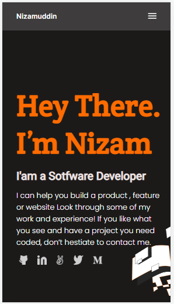

# My-Portfolio

> This is my first Project creating my Portfolio. This project was assign to me by microverse. I did it with my all effort to create the Portfolio as it is in the figma which was given to me by the microvese.

Additional description: This project is only built with Html and CSS.

## Built With

- HTML/CSS

## Getting Started

This is my first Project creating my Portfolio. This project was assign to me by microverse. I did it with my all effort to create the Portfolio as it is in the figma which was given to me by the microvese.

👤 Nizamuddin Ahmadzai

- GitHub: [@Nizamuddin4493](https://github.com/Nizamuddin4493)
- Twitter: [@Nizamuddin4493](https://twitter.com/Nizamuddin4493)
- LinkedIn: [nizam-udd-in-ahmadzai](https://www.linkedin.com/in/nizam-ud-din-ahmadzai-793269147/)

## 🤝 Contributing

Any type of contribution will be appreciated.

Feel free to check the [issues page](../../issues/).

## Show your support

Give a ⭐️ if you like this project!

## Acknowledgments

- Self coded no code was copied from any resource.

## 📝 License

This project is ISC licensed.
